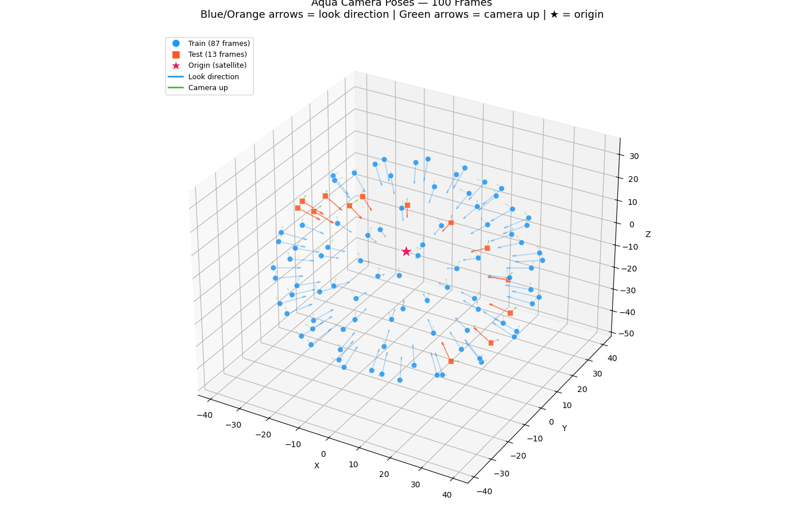

# 实验记录

最新在前。每条格式：日期 + 做了什么 + 结论/数字 + 遗留问题。结果图片直接放本文件夹，用相对路径引用。
---
## 2026-07-09 学习3DGS的原理
- 3DGS：基于Splatting和机器学习的三维重建方法
- 核心：均值与协方差
- 教程： https://www.bilibili.com/video/BV1zi421v7Dr/
- 点云：一堆离散的点
- Mesh：在点与点间建立的连接关系，使其变成连续的面。eg：三角形
- GS：以高斯（椭球）作为基底，作为Mesh
### 一、捏雪球
- Splatting:（拟声词）吧唧一声，像扔雪球一样扩散、喷溅到墙面上
1.作用：将3D物体渲染到2D平面（体渲染）
2.方法：计算每个发光粒子如何影响像素（主动式）（主角是发光粒子）（前向传递）
3.特点：快，效果一遍（所以需要优化）
- 点（云）的核为椭球高斯：$$
G(x) = \frac{1}{\sqrt{(2\pi)^k |\Sigma|}} e^{-\frac{1}{2}(x-\mu)^T \Sigma^{-1}(x-\mu)}
$$
1.  $\Sigma$ 为协方差矩阵
2. 等概率密度面是一个椭球面。所以概率密度从0到1就把椭球面积分成椭球
- 各向异性，各向同性
1.各向同性：球，所有方向梯度相同，$\Sigma$为数量矩阵。
2.各向异性则相反
- 协方差矩阵可以控制椭球形状
任意高斯可以由标准高斯通过仿射变换得到
$$
\begin{aligned}
\mathbf{w} &= A\mathbf{x} + b \\
\mathbf{w} &\sim \mathcal{N}\left(A\boldsymbol{\mu} + b,\, A\Sigma A^T\right)
\end{aligned}
$$
即：对球进行仿射变换可以得到任意形状的椭球
- 用旋转和缩放矩阵表达协方差矩阵
仿射变换由旋转R、缩放S、平移b来完成
A=R*S 即可推得：$
\begin{aligned}
\Sigma &= A \cdot I \cdot A^T 
= R \cdot S \cdot (S)^T \cdot (R)^T
\end{aligned}
$
R、S可由 $\Sigma$ 特征值分解得到
### 二、抛雪球
- 观测变换
1.从世界坐标系到相机坐标系
2.从不同的角度看，呈现不同的形状
3.“横看成岭侧成峰，远近高低各不同”
4.本质是“仿射变换”     
- 投影变换
1.已经在相机上了，去看物体，3D到2D
2.正交投影：与深度z无关，无远小近大
  将立方体平移到原点后缩放
3.透视投影：与深度有关，远小近大
先把锥体压成立方体，再正交投影
非线性，即非仿射变换
4.最后均得到[-1,1]的正方形
- 视口变换
将投影得到的正方形拉伸回图片像素网格的平面
- 光栅化
将连续的像素离散化，放到屏幕的一个个发光管上
方法：采样
连续平面到离散平面
- 以上就是CG层面3D到2D的过程
- 3DGS的观测变换
对均值和协方差做仿射变换：w=Ax+b
- 3DGS的投影变换
1.透视到正交投影（将锥压成立方）需做非线性变换--会导致非高斯--如何解决？
2.可以对非线性变换的局部足够小的地方线性近似--导数
3.引入雅可比矩阵（在3D高斯中心点附近）：
$$
J = \begin{bmatrix}
\dfrac{\mathrm{d}f_1}{\mathrm{d}x} & \dfrac{\mathrm{d}f_1}{\mathrm{d}y} \\[6pt]
\dfrac{\mathrm{d}f_2}{\mathrm{d}x} & \dfrac{\mathrm{d}f_2}{\mathrm{d}y}
\end{bmatrix}
$$
4.对均值做非线性变换：无影响
5.对协方差非线性变换：用雅可比矩阵代替仿射矩阵A
6.实际上雅可比矩阵的作用是线性近似+视口变换，所以只有均值需要再做一次视口变换
7.根据补充知识可得，投影变换矩阵：
$$
\begin{bmatrix}
f_1(x) \\
f_2(y) \\
f_3(z)
\end{bmatrix}
=
\begin{bmatrix}
\dfrac{nx}{z} \\[6pt]
\dfrac{ny}{z} \\[6pt]
(n+f) - \dfrac{nf}{z}
\end{bmatrix}
$$
即可算出雅可比矩阵：
$$
J =
\begin{bmatrix}
\dfrac{\partial f_1}{\partial x} & \dfrac{\partial f_1}{\partial y} & \dfrac{\partial f_1}{\partial z} \\[6pt]
\dfrac{\partial f_2}{\partial x} & \dfrac{\partial f_2}{\partial y} & \dfrac{\partial f_2}{\partial z} \\[6pt]
\dfrac{\partial f_3}{\partial x} & \dfrac{\partial f_3}{\partial y} & \dfrac{\partial f_3}{\partial z}
\end{bmatrix}
=
\begin{bmatrix}
\dfrac{n}{z} & 0 & -\dfrac{nx}{z^2} \\[6pt]
0 & \dfrac{n}{z} & -\dfrac{ny}{z^2} \\[6pt]
0 & 0 & -\dfrac{nf}{z^2}
\end{bmatrix}
$$
- 3DGS的视口变换
1.只对高斯核中心（均值）做平移和缩放
2.与协方差无关
- 3D高斯中心（均值）的变换
观测变换、投影变换、视口变换、光栅化
- 3D高斯协方差矩阵的变换
1.w2c：view矩阵
2.视锥到立方体：雅可比矩阵

#### 补充：CG知识：GAMES101
【GAMES101-现代计算机图形学入门-闫令琪】https://www.bilibili.com/video/BV1X7411F744?p=4&vd_source=7b414b12a55fe36688885e68f26d5cdf
- 二维点/向量的齐次坐标（将平移写到矩阵中）
1.点：(x,y,1)
2.向量:(x,y,0),平移不变性
3.$
\begin{pmatrix} x , y , w \end{pmatrix}^T \text{ 等价于 } \begin{pmatrix} x/w , y/w , 1 \end{pmatrix}^T,\quad w \neq 0
$ 适用于点的加法
4.三维同理，即变换矩阵，特殊欧式群$SE(3)
5.先旋转再平移。可以拆成三个矩阵：旋转、缩放、平移。谁先左乘先做谁
- 约定：相机固定在原点，朝向-Z，向上为Y（好处多多）
- 正交投影
1.简单点：放好相机，将z坐标扔掉，即可得图
2.正规点：规定好这一块区域，用xyz的范围定义一个空间中的立方体，先将中心平移至原点，再缩放成[-1,1]^3的正方体。会把原来的形状标准化，后续视口变换拉伸回去
- 透视投影
1.先把四棱锥压成立方体(近平面整个不变，近和远平面的z不变，中心点不变)
由相似三角形，可以算出挤压的比例，即可得到变换矩阵对应x，y的行。
由近和远平面的z不变，即可得到变换矩阵对应z的行
所以出现反直觉现象：中间的点z会发生变化
2.再做正规的正交投影，即左乘矩阵

### 三、雪球颜色
- 球谐函数：将傅里叶变换的思想引入球体中
1.球谐函数值为三维向量，表示RGB三通道
2.函数有1到6阶
3.与高斯椭球不相干，一个表达颜色，一个表达物理世界
- 为什么球谐函数能更好的表达颜色
1.维度高，存储信息多
2.可以有贴图
3.阶数越高，颜色越准确
4.因为是椭球，各个方向可以有不同的表达
- 足迹合成：计算每个发光粒子对像素点的合力
对光线上粒子颜色进行求和，与NeRF的公式一致，但更快
$$
\begin{aligned}
C &= T_i \alpha_i C_i = \sum_{i=1}^{N} T_i \left(1 - e^{-\sigma_i \delta_i}\right) C_i
\end{aligned}
$$
其中$T_i$为没有被阻挡的概率(有深度信息计算得)
$\alpha_i$为不透明度(分为2部，1.高斯椭球本身的不透明度。2.抛雪球的远近)
$C_i$为颜色(由球谐函数得到)
1.近处和远处抛雪球的影响不一样
2.省去的找粒子的过程
3.GPU的原理使Splatting更快，每个cuda并行计算
4.遍历每个高斯球去算颜色

### 四、高性能渲染与机器学习
- 算法流程：
1.用SFM算法得到初始点云(效果与其强相关，所以要做三个补丁：大的拆分，小的clone，存在感低的剔除)
2.将每个点膨胀成3d高斯椭球(用kNN找3近邻的距离的平均，作为球半径)
3.进行Splatting，得到图片
4.图片和GT做loss
5.反向传导回来，优化下列系数
6，对椭球的参数进行估计：中心点位置(x,y,z)，协方差矩阵(R,S)，球谐函数系数(16*3)，不透明度(alpha)

---

## 2026-07-08 完成阶段一：可视化 100 帧相机位姿
- 内容：完成以下工作
1.下载 Aqua 仿真数据放到 ./data/。
2.阅读了训练集和测试集，数据包含相机视场角，以及每一帧的变换矩阵
3.写了一个可视化100帧相机位姿的python脚本，运行即可得图

- 结论：每一帧照相机均指向原点，符合约定
- 遗留：python语法不熟悉，需要边用边学（代码由ai辅助完成）
---
## 2026-07-07 学习git基础知识，提交第一个pr
- 内容：学习了git的合作开发模式，并push到github上，也学习了
怎么提交pr
- 原理教程：https://missing-semester-cn.github.io/2020/version-control/
- 遗留：没搞清楚pr是什么意思，还有后续怎么合并？

---
## 2026-07-06 仓库初始化，Aqua 跑通验证

- 环境：RTX 4090 24G，conda 环境 `2dgs`（Python 3.10 + torch 2.1.0 cu118），按 README 步骤配置，CUDA 扩展编译通过。
- 数据：`data/Aqua/`，100 帧 1024×1024（87 训练 / 13 测试）。
- 命令：`python train.py -s ../data/Aqua -m output/Aqua --eval`，30k 迭代，约 8 分钟，显存峰值约 3 GB；随后 `render.py` 提取 mesh（fuse_post.ply，574 万顶点）、`metrics.py` 算指标。
- 结果：测试集 PSNR 31.53 / SSIM 0.984 / LPIPS 0.022。测试视角 GT（左）与渲染（右）对比：

- 观察：7k 迭代测试 PSNR 35.9，30k 降到 31.7，原因是中后段开启深度畸变/法线一致性正则，牺牲光度换几何；渲染图上细杆状全向天线有丢失，帆板边缘略糊，属 vanilla 2DGS 对薄结构的已知短板。
- 遗留：无阻塞问题。参考指标已回填 goal_todo.md。
