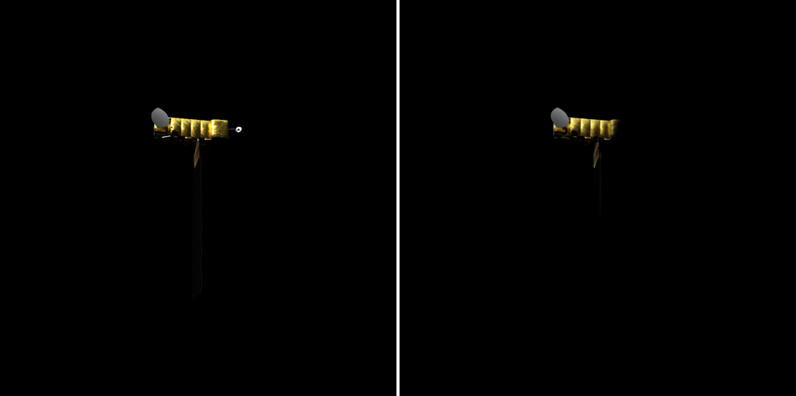

# 实验记录

最新在前。每条格式：日期 + 做了什么 + 结论/数字 + 遗留问题。结果图片直接放本文件夹，用相对路径引用。

---

## 2026-07-06 仓库初始化，Aqua 跑通验证

- 环境：RTX 4090 24G，conda 环境 `2dgs`（Python 3.10 + torch 2.1.0 cu118），按 README 步骤配置，CUDA 扩展编译通过。
- 数据：`data/Aqua/`，100 帧 1024×1024（87 训练 / 13 测试）。
- 命令：`python train.py -s ../data/Aqua -m output/Aqua --eval`，30k 迭代，约 8 分钟，显存峰值约 3 GB；随后 `render.py` 提取 mesh（fuse_post.ply，574 万顶点）、`metrics.py` 算指标。
- 结果：测试集 PSNR 31.53 / SSIM 0.984 / LPIPS 0.022。测试视角 GT（左）与渲染（右）对比：

- 观察：7k 迭代测试 PSNR 35.9，30k 降到 31.7，原因是中后段开启深度畸变/法线一致性正则，牺牲光度换几何；渲染图上细杆状全向天线有丢失，帆板边缘略糊，属 vanilla 2DGS 对薄结构的已知短板。
- 遗留：无阻塞问题。参考指标已回填 goal_todo.md。
